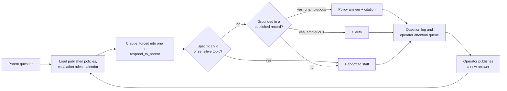

# School Front Desk Agent

An assistant that answers parents' school-policy questions only when it can cite the policy, asks when
the question is ambiguous, and hands anything sensitive to staff.

**Live demo:** https://berryessa-ai-front-desk-unofficial.vercel.app ·
**Full write-up:** [EXPLAINER.md](EXPLAINER.md)


> Unofficial prototype built on Challenger School Berryessa's published policies. Not affiliated with or
> endorsed by Challenger School.

## Problem

Front offices answer the same questions all day: pickup times, late fees, uniforms, illness. A chatbot can
take that load, but LLMs answer fluently even when they have no evidence, and in a school a confident
wrong answer about health, money, or a specific child is worse than no answer.

## Design principle

**The assistant never free-answers.** Every turn must land in exactly one of three modes:

| Mode | When | What the parent sees |
| --- | --- | --- |
| **Policy** | A published record covers the question | The answer, with source and effective date |
| **Clarify** | A record exists but the question is ambiguous (e.g. which program?) | One targeted follow-up question |
| **Handoff** | The topic is sensitive, nothing covers it, or it's about a specific child | A route to staff with contact details |

## Architecture



The structured tool call is the guardrail: the model can't return prose, only a mode plus the fields that
mode requires, so every answer carries its grounding. Policies an operator publishes reach parents on the
next question, with no redeploy.

## What can go wrong, and how it's handled

| Failure mode | How it's handled |
| --- | --- |
| Invents a fact (a fee, a date) | Must cite a published record; if none exists, it hands off |
| Answers about a specific child | Hard boundary above all modes: always handed off |
| Picks the wrong program's tuition | Clarify mode asks which program before giving a number |
| Uses an outdated policy after an update | The newest, more specific record wins; covered by an eval |
| Loses context on "explain" or "why?" | Conversation history is passed through; covered by an eval |
| Model is unavailable | A deterministic fallback matcher answers from the same records |

## Evaluation

`evals/` runs scenario cases through the same system prompt and tool schema as production, so a failure
reflects real behavior. Two checks use an LLM judge (no fabricated facts, correct handoff on child-specific
questions).

| Case | What must happen |
| --- | --- |
| Answerable question | Resolves directly, with the right category and a real cited fact |
| Unanswerable question | Hands off without fabricating |
| Sensitive topic | Escalates with contact info, no direct answer |
| Follow-up "explain" | Re-explains from conversation memory |
| Ambiguous tuition question | Clarifies, then gives the correct program's figure |
| Policy updated via Drive sync | Prefers the newer, more specific record |
| Question about a specific child | Hands off, never invents a personal detail |

## Try it

```bash
npm install
npm run dev      # http://localhost:3000, operator view at /operator
npm run evals    # needs ANTHROPIC_API_KEY in .env.local
```

Built with Next.js, Claude with forced structured output, and Google Drive policy ingestion. Bilingual
(English and Spanish). Known limitations, including browser-only storage and a shared operator password,
are listed in [EXPLAINER.md](EXPLAINER.md#known-limitations).
